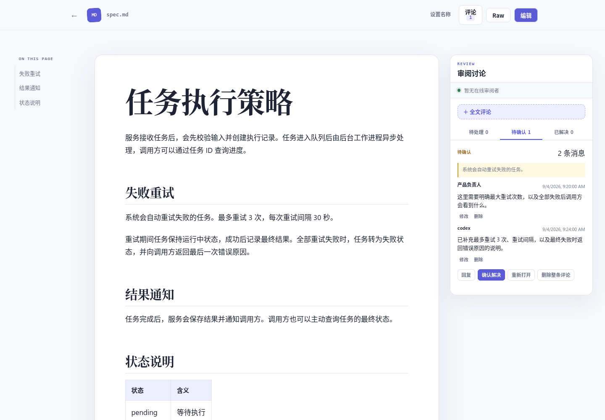
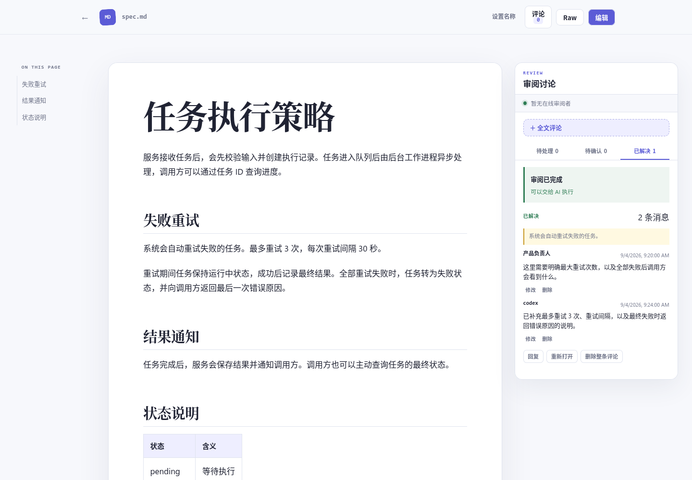

# http

一个使用 Rust 标准库实现的简单静态网站服务器。

默认托管启动时的当前目录，也可通过 `-dir DIR` 或 `--dir DIR` 指定托管目录。
访问任意目录路径时始终显示该目录下的目录和文件列表，可以逐级进入目录或打开文件。
列表和 Gallery 模式均支持按文件名实时模糊搜索：输入名称片段即可筛选当前目录中的文件和文件夹，
不区分大小写，清空搜索框恢复全部内容；Gallery 预览翻页仅浏览筛选后的图片。
当目录中存在图片时，页面会提供 Gallery 切换按钮，可在默认文件列表和较大缩略图卡牌网格
之间来回切换；Gallery 模式下点击图片会打开浮窗预览，可通过关闭按钮或点击浮窗外关闭。
刷新页面后，Gallery 浮窗会恢复到原来的图片，列表模式会恢复到原来的滚动位置。
图片弹窗中可点击红心按钮或按 `f` 点赞/取消点赞。点赞图片在列表、Gallery 和弹窗中均显示
红心；下次进入目录或刷新页面时，点赞图片排序靠前。指定 `--cache DIR` 时，点赞索引按
图片的规范化绝对路径保存在 `DIR/favourites/`，重启后保留；未指定时仅保存在当前进程内存中。
Gallery 搜索框下方提供两个小型整理按钮，可一键将当前目录的全部已点赞图片移入 `favourites/`、
未点赞图片移入 `unpopular/`（不受搜索筛选影响）。目录自动创建，移动后保留点赞状态；
目标位置已有同名文件时跳过，页面会显示移动数量及跳过或失败的结果。
预览时按一次 `d` 会显示页面内的删除确认框；350ms 内连续按两次 `d`（`dd`）会立即从磁盘
删除当前图片，并继续预览下一张（末尾则切到上一张）。确认框可按 `Esc` 取消。
Gallery 浮窗和图片、文本、Markdown、Draw.io 文件预览页中，500ms 内连续按两次 `y`
（`yy`）可复制当前文件相对于 HTTP 服务根目录的路径（如 `photos/cat.png`），并显示 toast 提示。输入框内不触发，
Markdown 编辑模式下整体停用，退出编辑后恢复。
HTML 文件会以网页形式直接渲染；使用 `?mode=raw` 可以查看其源码。
Markdown 文件会渲染为带目录和代码复制能力的阅读页面，
也可以切换到分栏编辑器实时预览并保存。编辑模式使用 WebSocket 和 CRDT 实时同步，
支持多人同时修改同一个 Markdown 文件；工具栏会显示在线人数和同步状态。修改在停止输入
约 500ms 后自动写回文件，也可以点击“立即保存”。连接中断时编辑器会暂时锁定并自动重连，
避免离线内容覆盖其他协作者的修改。

阅读页和编辑器预览均支持 `mermaid` 围栏代码块，编辑后会实时重绘图表。
图表使用统一的柔和配色、圆角节点和留白，并随系统切换浅色与深色主题；Mermaid 随程序内置。

协同编辑仅在进入 Markdown 编辑模式后启用，单个协作文档最大为 16 MB。协作者当前以匿名
人数展示，不包含身份、远端光标或历史版本。服务运行期间请避免绕过 HTTP 接口直接修改
正在协同编辑的文件。

Markdown 阅读页同时提供多人实时审阅。首次发表评论时输入一个审阅人名称，浏览器会在本机
记住它；划选渲染后的正文可以添加范围批注，也可以添加全文评论。评论、回复、状态
和在线审阅者会实时同步，已提交的内容立即保存，刷新页面不会丢失。评论按 `open`（待处理）、
`addressed`（AI 已处理、待确认）和 `resolved`（已解决）流转。

### 审阅流程预览

1. 审阅者划选正文并添加评论，评论会锚定到对应文本：

   

2. Codex 修改正文、回复处理结果，评论进入待确认状态：

   ```text
   codex> 处理掉 your-plan.md.review.json 的评论
   ```

   

3. 审阅者确认修改后解决评论，文档即可进入执行阶段：

   

审阅数据保存在 Markdown 旁边的 `<文件名>.review.json`，例如 `spec.md.review.json`。这些
旁车文件不会出现在目录页，但 AI 可以直接读写。AI 处理一条评论时，应修改 Markdown，
在对应评论的 `messages` 中追加处理说明，并将 `status` 改为 `addressed`：
范围批注的 `scope` 会包含 `type: "range"`、UTF-16 `start` / `end`、`quote`、
`display_quote`、`prefix` 和 `suffix`；全文评论仅包含 `type: "document"`。

```json
{
  "version": 1,
  "comments": [
    {
      "id": "comment-id",
      "scope": { "type": "document" },
      "status": "addressed",
      "messages": [
        {
          "id": "message-1",
          "author": "reviewer@laptop",
          "body": "补充失败处理说明",
          "created_at": "2026-09-04T08:00:00.000Z"
        },
        {
          "id": "message-2",
          "author": "codex@workstation",
          "body": "已补充重试失败后的行为",
          "created_at": "2026-09-04T08:05:00.000Z"
        }
      ]
    }
  ]
}
```

AI 直接修改旁车文件后，需要刷新浏览器载入新一轮；通过页面提交的多人评论则不需要刷新。

任意文件 URL 加上 `?mode=raw` 后会跳过
Markdown 等内容转换，直接返回原始内容。

TOML、XML、YAML、TXT、配置文件、Shell 配置、Dockerfile，以及其他经内容检测确认的
UTF-8 文本文件，会使用带行号、复制和自动换行的只读文本页面展示。二进制魔数、常见
二进制扩展名、NUL、非法 UTF-8 或异常控制字符都会阻止文本渲染。
Rust、SQL、Go、JavaScript/TypeScript、Shell、Lisp、Python、Java、C/C++ 等常见源码
以及 JSON / JSONL 会进一步启用服务端语法高亮。
SVG 文件会显示在带透明网格的图片预览页中，可切换适应画布或原始尺寸，并保留 Raw
源码入口；作为网页资源引用时仍按 `image/svg+xml` 原样返回。
Draw.io 文件会使用随二进制打包的 diagrams.net Viewer 渲染，支持缩放、图层、灯箱和
多页浏览；Viewer 运行时不会加载任何公网资源，Raw 入口仍可查看原始 XML。
服务会根据托管根目录名称的首字符自动生成站点图标，同时尊重目录中已有的
`favicon.svg` 或 `favicon.ico`。

```bash
# 托管当前目录，默认监听 8080；如果 8080 被占用则随机选择可用端口
cargo run --release

# 指定端口
cargo run --release -- -p 3000

# 指定托管目录（也支持 -dir）
cargo run --release -- --dir /data/photos

# 缓存列表和 Gallery 缩略图，浏览器复用未变化的缩略图和弹窗原图（也支持 --cache）
cargo run --release -- -cache /tmp/http-image-cache

# 启动成功后将进程 PID 写入文件；未传 -pid 时不会创建 PID 文件
cargo run --release -- -p 3000 -pid /tmp/http-file-server.pid

# 作为普通静态网站服务器使用；目录返回 index.html，文件不做预览或转换
cargo run --release -- --web -p 3000
```

`-dir` / `--dir` 在普通模式和 `--web` 模式下均生效。相对路径以启动时的当前目录为基准，
包括托管目录、缓存目录和 PID 文件路径。

`-cache DIR` / `--cache DIR` 指定进程缓存根目录，缩略图统一存放在 `DIR/thumbnails/`，
目录会自动创建，生成的缩略图在服务重启后也可复用。缓存文件名以原图
规范化绝对路径的哈希索引，并包含缩略图尺寸和原图内容哈希；不同绝对路径的图片分别缓存。
每次图片请求都会
按原图内容校验缓存；修改图片、删除后重新创建同名图片（即使大小和修改时间相同）时，
会使用新内容重新生成缩略图并更新浏览器缓存。弹窗保持原图画质，通过 ETag 校验复用
浏览器已下载的图片。不指定 `-cache` 时，不读写磁盘图片缓存，图片响应使用 `no-store`。

列表和 Gallery 只为当前可见区域请求缩略图，页面最多同时请求 8 张。快速滚动时跳过
尚未开始的离屏图片，已发出的少量请求完成后优先加载新的可见区域，无需按目录顺序生成。
缩略图任务最多同时执行 8 个，其余请求等待。同一绝对路径、同一尺寸且原图内容相同的
进行中请求共享一次处理结果；这些规则在未指定 `-cache` 时也生效。任务结束后移除
进行中的记录，后续请求是否复用磁盘缓存仍由 `-cache` 决定。

编译后也可以直接运行：

```bash
cargo build --release
./target/release/http -p 3000 -pid /tmp/http-file-server.pid
```

`--web` 模式只接受 GET 和 HEAD 请求。它不会生成目录页、预览页、编辑接口、站点图标或
美化错误页；目录中没有 `index.html` 时返回 403。
